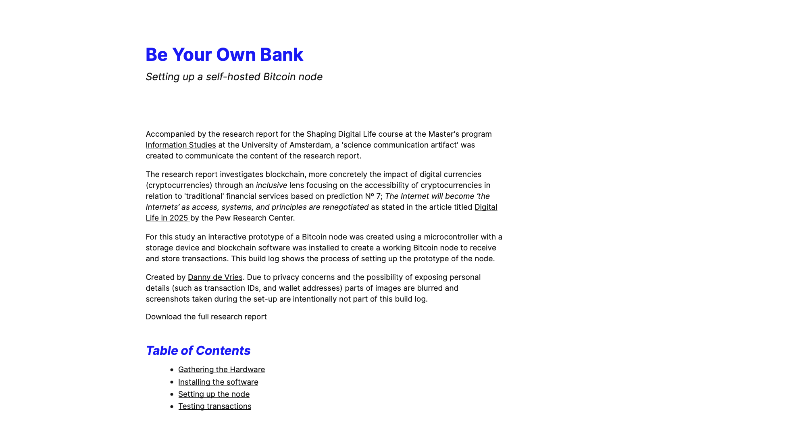

# shaping-digital-life-artefact
> Build log of the Shaping Digital Life artefact

## Description

Accompanied by the research report for the Shaping Digital Life course at the Master's program Information Studies at the University of Amsterdam, a 'science communication artifact' was created to communicate the content of the research report.

The research report investigates blockchain, more concretely the impact of digital currencies (cryptocurrencies) through an inclusive lens focusing on the accessibility of cryptocurrencies in relation to 'traditional' financial services based on prediction Nº 7; The Internet will become ‘the Internets’ as access, systems, and principles are renegotiated as stated in the article titled Digital Life in 2025 by the Pew Research Center.

For this study, an interactive prototype of a Bitcoin node was created using a microcontroller with a storage device and blockchain software was installed to create a working Bitcoin node to receive and store transactions. This build log shows the process of setting up the prototype of the node.

Created by Danny de Vries. Due to privacy concerns and the possibility of exposing personal details (such as transaction IDs, and wallet addresses) parts of images are blurred and screenshots taken during the set-up are intentionally not part of this build log.

## Live version

A live version of this website can be viewed on https://shaping-digital-life.dandevri.es/.

## License

Unless stated otherwise, code is MIT © [Danny de Vries](https://github.com/dandevri) & docs and images are [CC-BY-4.0](https://creativecommons.org/licenses/by/4.0/).